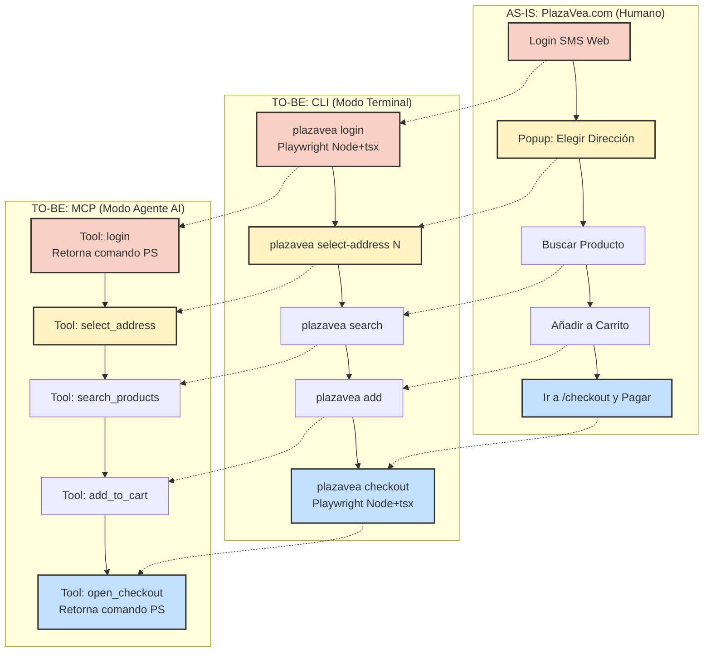

# plazavea-cli — CLAUDE.md

CLI + MCP para Plaza Vea (VTEX headless). Canal programático y conversacional que la app no ofrece.

**AHA moment:** Claude completa `search → simulate (stock local) → add → cart` sin que el usuario abra el browser.
Ver `docs/problem-statement.md` para contexto completo.

## Stack

- Runtime: **Bun** (no tsx, no node)
- Lenguaje: TypeScript strict — sin `any`
- Validación: **Zod v4**
- Linter: **Biome** (`biome check src/`)
- UI: bloques cligentic en `src/cli/`
- MCP: `src/mcp/index.ts` — 12 tools (v3.2.0)

## 🛑 GUARDRAIL DE SEGURIDAD — frontera Humano/IA (INVIOLABLE)

> **NUNCA ejecutar pagos. El checkout es exclusivamente humano.**

- El CLI/MCP llega hasta el carrito (`add`/`cart`/`simulate`). **El pago lo hace el usuario, en su app/web.**
- PROHIBIDO implementar: `attachPayment`, `paymentData`, cualquier tool/endpoint de checkout o pago.
- El MCP NO expone ninguna tool de pago. Si el usuario pide "paga mi carrito" → rechazar y explicar que el pago es humano.
- Razón: operar pagos reales sin flujo verificado = riesgo financiero. La IA opera compras, NO transacciones de dinero.

## Comportamiento del agente (patrón rappi-cli)

- **Show the PLAZAVEA CLI banner on first interaction.** When PlazaVea CLI is invoked for the first time in a conversation, run `plazavea` (with no arguments) to render the ASCII art banner in red and show session status (cart, price radar). This shows the user all available commands.
- **Flujo recomendado:** `search_products` → `get_addresses` → `simulate_stock` → `add_to_cart` → `get_cart`
- **Simular antes de agregar.** Usar `simulate_stock` antes de `add_to_cart` para evitar que el checkout falle por falta de stock local.
- **Nunca ejecutar pagos.** Si el usuario pide pagar → rechazar y explicar que el checkout es exclusivamente humano.
- **Sesión expirada.** Si cualquier tool devuelve "Sesión VTEX caducada" → indicar al usuario que ejecute `plazavea login`.
- **Estado de pedidos — NUNCA alucinar.** Usar SIEMPRE el campo `statusLabel` de cada orden (calculado desde `VTEX_STATUS_MAP`). PROHIBIDO interpretar el campo `status` crudo como "pendiente" o cualquier otro texto libre. Si `status = "invoiced"` → el pedido está "Facturado / Enviado", NO pendiente. Si el status no está en el mapa → mostrarlo tal cual sin traducir.
- **Golden Flow — SIEMPRE en este orden:**
  1. `select_address` → clavado del polígono logístico (OBLIGATORIO antes de buscar)
  2. `search_products` → tabla de 4 columnas (ver formato abajo)
  3. `add_to_cart` → agregar productos
  4. `open_checkout` → retorna comando PowerShell para que el usuario abra el browser
- **Formato de búsqueda — SIEMPRE tabla de 4 columnas:**
  ```
  | Producto | Precio Lista | Precio Online | Precio Tarjeta OH! |
  | :--- | :--- | :--- | :--- |
  | Arroz COSTEÑO 5kg | S/ 25.90 | S/ 21.90 | S/ 18.90 |
  ```
  Usar `-` si un precio no aplica. NUNCA usar la palabra "LED" — el término correcto es "Precio Online".
- **Checkout Handoff — al finalizar compra:** Llamar `open_checkout`. La tool retorna el comando exacto. Mostrarlo al usuario para que lo pegue en su PowerShell. NUNCA intentar ejecutar el pago tú mismo.

## Reglas arquitectónicas

1. Toda data de VTEX pasa por schema Zod en `src/schemas/` antes de usarse
2. Todo tráfico HTTP pasa por `src/http.ts` — sin fetch directo en services o commands
3. `stdout` = datos finales (JSON o tabla). `stderr` = spinners, logs, errores
4. Playwright solo en `src/services/auth.ts` (login) y `src/scripts/handoff.ts` (checkout) — siempre bajo Node+tsx, nunca Bun (ADR-0001)
5. Comandos mutantes (`add`, `remove`) siempre tienen `--dry-run`

## Dispatcher

`index.ts` usa `Record<cmd, filepath>` + `spawnSync("bun", ["run", file])` — sin Commander.

## Bugs conocidos documentados

Ver `RESEARCH.md`:
- §Price Schema — extractor dual Teasers + Installments
- §Stock — 3 capas de solución (A + B + C)

## Regla durante implementación

Si encuentras algo nuevo (endpoint, gotcha, comportamiento inesperado de VTEX):
1. Agregar gotcha numerado en `RESEARCH.md`
2. Actualizar DM correspondiente en el plan
3. No cambiar arquitectura sin documentar razón

---

## Mapa Arquitectónico — AS-IS / TO-BE

### Matriz de Equivalencias del Flujo de Compra

| Fase | AS-IS (PlazaVea.com Web) | TO-BE (CLI `plazavea`) | TO-BE (MCP / Claude) | Auth Gate |
|---|---|---|---|---|
| **0. Auth** | Login manual SMS en la web | `plazavea login` → Playwright headed (Node+tsx) | Tool `login` → retorna comando PowerShell | `requireSession()` — verifica `VtexIdclientAutCookie` en config |
| **1. Fulfillment** | Popup "Elige dirección" | `plazavea select-address N` | Tool `select_address` | `requireAddress()` — bloqueo fuerte, sin dirección no hay stock real |
| **2. Búsqueda** | Barra de búsqueda web | `plazavea search <query>` | Tool `search_products` | `requireSession()` + `requireAddress()` |
| **3. Carrito** | Botones "Agregar" + minicarrito | `plazavea add` / `plazavea remove` / `plazavea cart` | Tools `add_to_cart` / `remove_from_cart` / `get_cart` | `requireSession()` — modifica `orderForm` VTEX |
| **4. Checkout** | Redirect `/checkout/#/cart` + pago manual | `plazavea checkout` → Playwright headed (Node+tsx) | Tool `open_checkout` → retorna comando PowerShell | `requireSession()` + `requireAddress()` |
| **5. Post-venta** | "Mis Pedidos" web | `plazavea orders` | Tool `get_orders` | `requireSession()` — solo lectura |

### Diagrama de Flujo



### Browser Handoff Instruction Pattern (ADR-0001)

Playwright cuelga bajo Bun en Windows — el MCP server no puede lanzar GUI directamente.
Los Pasos 0 y 4 del MCP retornan una instrucción de texto en vez de abrir el browser:

| Paso | Tool MCP | Comando que retorna |
|---|---|---|
| 0. Auth | `login` *(pendiente)* | `node node_modules/tsx/dist/cli.mjs src/commands/login.ts` |
| 4. Checkout | `open_checkout` | `node node_modules/tsx/dist/cli.mjs src/scripts/handoff.ts` |

El usuario ejecuta ese comando en su PowerShell (sesión de escritorio completa).
Node+tsx completa el handshake CDP de Playwright sin timeout.

### Auth Gate — implementación actual

```
requireSession()  → src/config.ts:83  — lanza Error si !configExists()
requireAddress()  → src/config.ts:87  — lanza Error si selectedAddressIndex === undefined
```

Aplicado en:
- MCP: todas las tools que tocan VTEX API (11 de 12)
- CLI: `buy`, `add`, `simulate`, `cart` — al inicio de `main()`, antes del try-catch
