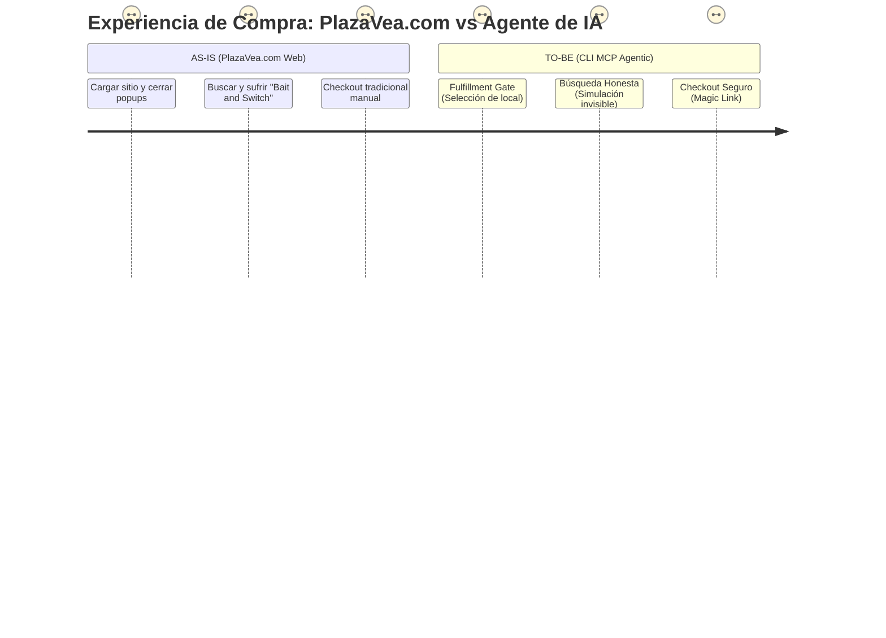

# Caso de Estudio: Plaza Vea Agentic CLI & MCP
Evolución de un e-commerce reactivo hacia un **Agentic Workflow Proactivo**.

## 🗺️ Mapa de Experiencia (UX Map)

```mermaid
journey
    title Experiencia de Compra: PlazaVea.com vs Agente de IA
    section AS-IS (PlazaVea.com Web)
      Cargar sitio y cerrar popups: 2, Usuario
      Buscar y sufrir "Bait and Switch": 2, Usuario
      Checkout tradicional manual: 4, Usuario
    section TO-BE (CLI MCP Agentic)
      Fulfillment Gate (Selección de local): 5, Usuario
      Búsqueda Honesta (Simulación invisible): 5, Agente IA
      Checkout Seguro (Magic Link): 4, Usuario
```
