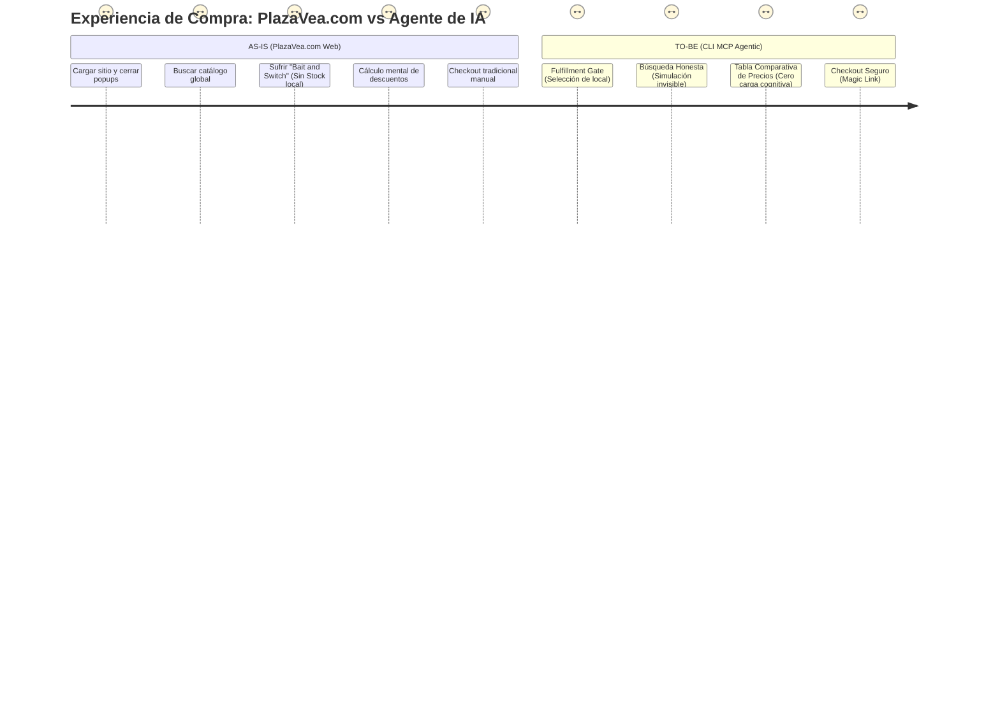

# Caso de Estudio: Plaza Vea Agentic CLI & MCP

> **Product Vision:** Transformar el e-commerce tradicional de Plaza Vea en un ecosistema Agentic (Agentic Workflow). Permitir a Modelos de Lenguaje (LLMs) operar como agentes autónomos para reducir drásticamente la fricción del usuario, delegando la carga cognitiva de búsqueda, validación de stock y comparación de precios a la IA.

---

## 🚨 El Problema: Fricción en el E-commerce Tradicional (AS-IS)

El modelo actual B2C en plataformas como PlazaVea.com exige una alta carga cognitiva y manual por parte del usuario:
1. **Fricción Visual:** Navegación interrumpida por popups, banners promocionales y tiempos de carga.
2. **El Problema del "Bait and Switch":** Los motores de búsqueda muestran catálogo global. El usuario descubre que un producto no tiene stock *después* de intentar agregarlo al carrito, generando inmensa frustración.
3. **Sobrecarga Cognitiva en Pricing:** El retail peruano maneja múltiples niveles de precios (Precio Lista, Precio Internet, Precio Tarjeta OH!). El usuario debe hacer matemáticas mentales constantes para validar si una oferta es real.

---

## 💡 La Solución: Agentic E-commerce (TO-BE)

Desarrollo de un servidor **MCP (Model Context Protocol)** que expone las APIs core de VTEX directamente a un LLM. En lugar de navegar, el usuario simplemente "conversa" su lista de compras con el agente.

### 🗺️ Mapa de Experiencia (UX Map)

---

## 🏗️ Innovaciones Arquitectónicas (The "Golden Flow")

Para garantizar una experiencia superior, el MCP implementa un flujo estricto y proactivo que previene los errores clásicos del e-commerce:

### 1. Autenticación Híbrida Blindada
La API de VTEX separa la sesión de navegación del carrito. El MCP utiliza **Playwright** en background para inicializar el storefront real y robar la cookie `checkout.vtex.com`, garantizando que el `orderFormId` del CLI sea el mismo que el del navegador web del usuario.

### 2. Fulfillment Gate (Adiós al Bait & Switch)
Ninguna búsqueda ocurre en el vacío. Antes de permitir explorar el catálogo, el MCP exige al usuario seleccionar una de sus direcciones guardadas (vía `/api/checkout/pub/profiles`). Esto hace un POST inmediato a `shippingData`, "clavando" el polígono logístico. A partir de ese momento, el stock es 100% real.

### 3. Búsqueda Honesta (Silent Simulation)
En lugar de mostrar resultados crudos del catálogo global, el MCP actúa como un *Personal Shopper*. Ejecuta llamadas invisibles a `simulate_stock` en el background. Si un producto no tiene stock en el polígono del usuario, la IA lo descarta automáticamente antes de mostrarlo en pantalla.

### 4. UI Estricta y Prevención de Alucinaciones
Se le prohíbe al LLM inventar formatos o términos (ej. alucinar "Precio LED"). Se fuerza mediante prompt una matriz estricta de 4 columnas para eliminar la carga cognitiva del usuario:

| Producto | Precio Lista | Precio Online | Precio Tarjeta OH! |
| :--- | :--- | :--- | :--- |
| Arroz PAISANA 5kg | S/ 25.90 | S/ 21.90 | S/ 18.90 |

### 5. Magic Checkout Link
El CLI no maneja datos de pago por seguridad. Al decir "Quiero pagar", el flujo termina instantáneamente entregando un puente directo sin fricción:
`👉 https://www.plazavea.com.pe/checkout/#/cart?orderFormId=xxx`

---

## 📈 Impacto de Negocio Esperado

- **Reducción del TTV (Time-to-Value):** De minutos navegando categorías a segundos con prompts de lenguaje natural ("Arma mi carrito semanal de despensa").
- **Tasa de Abandono (Cart Abandonment):** Reducción esperada al eliminar la fricción del "Bait and Switch" de stock en etapas tardías del embudo.
- **Retención:** Fidelización de usuarios power-users mediante una interfaz de consola ultrarrápida.
